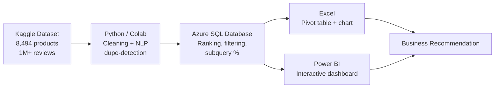
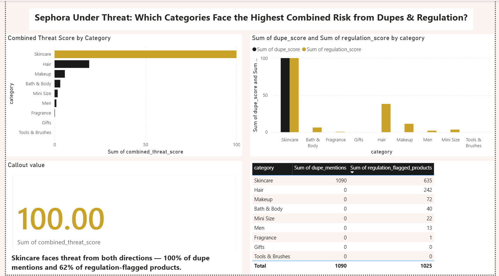

# Sephora Under Threat: Which Product Category Faces the Highest Combined Risk?

**A business analytics case study on dupe culture and age-restriction regulation in the beauty industry.**

## Business Question
Sephora is being squeezed from two directions at once:
- **From below** — "dupe culture" (customers hunting for cheaper alternatives to premium products, amplified by TikTok/Reddit — see the viral "Sephora kids" moment)
- **From above** — age-restriction regulation on anti-aging skincare ingredients (e.g., Connecticut's 2024 settlement with Sephora, California's proposed AB 728)

**Which product category absorbs the most damage from both threats combined?**

## Pipeline Architecture

## Key Finding
**Skincare** faces the highest combined threat by a wide margin:

| Metric | Skincare | Next-highest category |
|---|---|---|
| Share of "dupe" mentions (1M+ reviews) | **100%** | 0% (all others) |
| Share of regulation-flagged products | **62%** | 24% (Hair) |
| Average price | $60.51 (2nd highest) | — |
| Customer rating | 4.23 / 5 | — |

Skincare pairs high price and high customer loyalty with the exact ingredients under regulatory scrutiny — meaning it has the most revenue at stake if either threat escalates further.

## Recommendation
1. **Defend**: Expand exclusive/limited-edition skincare lines, strengthen loyalty perks specifically for high-price skincare, and use review data to identify which SKUs get "duped" most for prioritized reformulation or repricing.
2. **Get ahead**: Proactively audit and label the 635 flagged skincare products before regulators mandate it; build an age-appropriate product finder now; monitor Hair and Makeup, which share Skincare's regulation exposure without the dupe pressure yet.

## Methodology & Known Limitations
Being upfront about what this analysis does and doesn't prove:

- **Dupe detection** uses a word-boundary text search (`\bdupes?\b`) across review text. An earlier version of this analysis used a plain substring match, which incorrectly counted words like "duper" as dupe mentions — this has been corrected; the finding (Skincare = 100% of dupe mentions) held after the fix.
- **The combined threat score** normalizes each category's count against the *maximum value in that same metric*, so the top category in each metric will always score 100 on that axis. In practice, this means the combined score largely reflects "which category has the most raw dupe mentions and flagged products," rather than adding independent statistical weight beyond that. It's a useful way to put two differently-scaled metrics (review mentions vs. product counts) onto one comparable axis — not a claim of deeper nuance.
- **Regulation flagging is a proxy**, based on whether a product's ingredient list *contains* retinol, glycolic acid, salicylic acid, or lactic acid — not on actual ingredient concentration or verified regulatory status. Real regulation targets concentration thresholds and marketing claims, which this dataset doesn't include. The 635-product figure should be read as "products that plausibly fall under this kind of scrutiny," not a legally verified count.

## Tools & Methodology

| Tool | What it did |
|---|---|
| **Python (Google Colab)** | Loaded and cleaned the Sephora Products & Reviews dataset (8,494 products, 1M+ reviews). Used word-boundary NLP text search to find "dupe" mentions across all reviews, merged results with product categories, and built a normalized 0–100 combined threat score per category. |
| **SQL (Azure SQL Database)** | Created and queried a cloud-hosted `threat_summary` table. Wrote ranking queries (`ORDER BY`), filter queries (`WHERE`) to find categories with regulation exposure but no dupe activity yet, and a subquery to calculate each category's % share of total regulation-flagged products. *(Azure free trial has since expired; final corrected results were verified in the query editor before the trial ended — see screenshots.)* |
| **Excel** | Built a pivot table and pivot chart for quick, stakeholder-friendly exploration of the summary data. |
| **Power BI** | Combined all findings into one interactive dashboard: a ranked bar chart, a dupe-vs-regulation comparison chart, a headline KPI card, and a detail table — styled with a custom black/gold/blush theme reflecting the beauty industry context. |

## Dashboard Preview

## Dataset
[Sephora Products and Skincare Reviews](https://www.kaggle.com/datasets/nadyinky/sephora-products-and-skincare-reviews) (Kaggle) — 8,494 products and ~1.09M customer reviews.

## Repository Structure
All files currently sit at the root of this repository:
- `sephora_dupe_regulation_analysis.ipynb` — Python: data cleaning, NLP dupe-detection, threat scoring
- `queries.sql` — SQL scripts (Azure SQL Database)
- `01_create_and_insert.png` through `04_percentage_share_subquery.png` — SQL query/result screenshots
- `Sephora_Threat_Summary.xlsx` — Pivot table + chart summary workbook
- `Sephora_Threat_Dashboard.pbix` — Interactive Power BI dashboard
- `dashboard_preview.png` — Dashboard screenshot (for quick preview without opening Power BI)
- `README.md`

## Author
**Khushi Chandel** — Final Year, Thakur College of Engineering and Technology, Mumbai
Aspiring Data/Business Analyst — Fashion, Beauty & Entertainment industries
